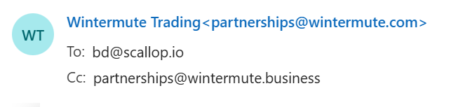
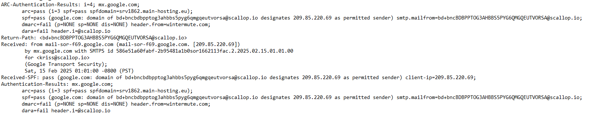
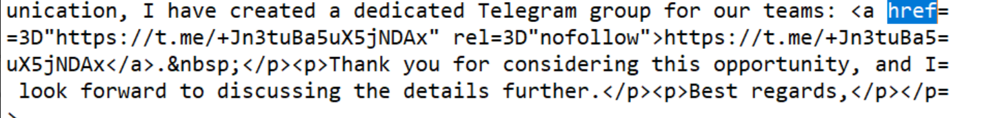

# Phishing Email Analysis

## Task 2 – Phishing Email Investigation

## Objective

The objective of this task is to analyze a suspicious email and identify common phishing indicators by examining the sender information, email headers, links, and message content.

## Sample Analyzed

**Email:** Wintermute & Scallop.io

The email was analyzed using its `.eml` file so that both the visible email content and the technical header information could be examined.

---

## 1. Sender Information

- **Displayed Sender:** Wintermute Trading
- **Email Address:** `partnerships@wintermute.com`
- **To:** `bd@scallop.io`
- **CC:** `partnerships@wintermute.business`

The email presents itself as a business communication from Wintermute Trading. The sender details were checked against the technical email headers for further verification.

---

## 2. Header Analysis

The email headers were checked to verify whether the sender information matched the authentication results.

- **SPF:** Pass
- **DMARC:** Fail
- **Header From:** `wintermute.com`
- **Return-Path:** `@scallop.io`
- **SPF Domain:** `srv1862.main-hosting.eu`

The DMARC failure is a major warning sign because the claimed `wintermute.com` sender did not pass DMARC authentication. The different domains shown in the sender and return-path information also make the email suspicious.

---

## 3. Link Analysis

The email contains a Telegram invite link:

`https://t.me/+Jn3tuBa5uX5jNDAX`

The link directs the recipient to a private Telegram group for further communication. Although `t.me` is a legitimate Telegram domain, the use of an external private communication channel is suspicious in the context of this email, especially when combined with the authentication failures and sender inconsistencies found in the headers.

The link was identified from the email source without opening or visiting it.

---

## 4. Email Body and Social Engineering

The email uses a business partnership theme to make the message appear legitimate and trustworthy.

- **Business opportunity lure:** The sender proposes a strategic partnership with Scallop.io.
- **Trust building:** The message presents itself as a professional business communication from Wintermute Trading.
- **External communication:** The recipient is directed to a private Telegram group for further communication.
- **Urgency or threats:** No strong urgency, deadline, or threatening language was identified.
- **Grammar and spelling:** The email is generally well-written, with no major spelling or grammar errors noticed.

These techniques can make the recipient more likely to trust the message and interact with the provided link.

---

## 5. Phishing Indicators

| Indicator | Evidence Found | Why It Is Suspicious |
|---|---|---|
| Sender spoofing | `partnerships@wintermute.com` | The claimed sender identity does not align with the technical header information. |
| DMARC failure | `dmarc=fail` for `wintermute.com` | The claimed sender domain failed DMARC authentication. |
| Sender/Return-Path mismatch | From: `@wintermute.com` vs Return-Path: `@scallop.io` | Different domains are involved in the visible sender and return path. |
| Different sending infrastructure | SPF domain: `srv1862.main-hosting.eu` | The sending infrastructure does not directly match the claimed sender domain. |
| Suspicious external link | Telegram invite link | The email directs the recipient to a private Telegram group for further communication. |
| Business opportunity lure | Strategic partnership proposal | A business opportunity can be used to gain the recipient's trust and encourage interaction. |
| Professional appearance | Business-style language and signature | A professional appearance can make a suspicious email seem legitimate. |
| Urgency or threats | None clearly identified | No strong urgency or threatening language was found. |
| Grammar and spelling | Generally well-written | No major grammar or spelling issues were identified. |
